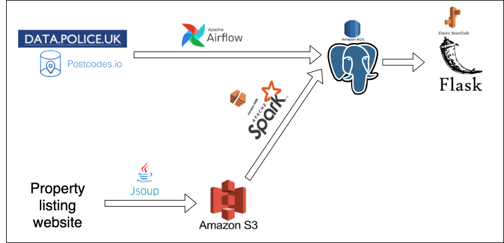

# Property and Crime

## Background
This personal project was designed to show the relationship between house prices of an area 
and its crime-rate, with emphasis on acquiring and warehousing data.

Data is specific to London Boroughs where my PropertyScraper repository was utilised. 

The Police API was used to pull raw crime data however they do not have endpoints 
which are London borough specific. However, the Police API does have an endpoint for neighbourhood codes.
These neighbourhood codes are specific for the Police force that are responsible for an area.
For London this would be the metropolitan force. \
There approximately 600 districts patrolled by the metropolitan force which maps to 600 neighbourhood codes.
It is capable to receive a list of latitudes and longitudes that encompass the area of each district
using the neighbourhood codes Police API endpoint.\
Then it is possible to map that list to its corresponding borough using Postcodes.io API.
After this, it is possible to get crimes per borough by passing a latitude and 
longitude polygon represented as a string to the Police Crimes endpoint.


##Architecture



Airflow is used to get new crimes data and insert it into a Postgres database hosted
on RDS.\
An environment variables file will be needed for postgres instance which will
be of the following form:

```sh
POSTGRES_DATABASE=""
POSTGRES_USER=""
POSTGRES_HOST=""
POSTGRES_PORT=""
POSTGRES_PASSWORD=""
```
To log into the instance use the command:

```
psql --host=<AWS RDS ENDPOINT> --port=5432 --username=<USERNAME> --password --dbname=propertycrime
```

After running the scraper to gain property price data, the output files were 
put into S3 buckets.\
A cluster was created on EMR to run the pyspark job. An EC2 key 
pair .pem file needs to be downloaded to ssh into the cluster after editing the 
inbound rules of the master node. \
Once in EMR, the job can be run by copying the python file into the cluster directory
and using the command:

```python
spark-submit spark_batch.py
```

## Deployment
The webapp itself is hosted on elastic beanstalk here: 
```url
http://londonpropertycrimes.eu-west-2.elasticbeanstalk.com/
```


One difficulty that arised was needing to connect to the ec2 instance itself 
to run this command as psycopg2 wasn't being recognised by EB: 
```
sudo yum install postgresql-devel
```

